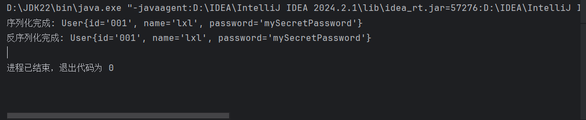

#  JavaWeb


**学院：省级示范性软件学院**

**题目：**《 会话扩展内容》

**姓名：**李小龙

**学号：**2200770141

**班级：**软工2202

**日期：**2024-09-28

**实验环境：** IDEA，Typora


> ### 一. 会话安全性:


##### 1.会话劫持和防御:

|                           会话劫持                           |                           会话防御                           |
| :----------------------------------------------------------: | :----------------------------------------------------------: |
| 会话劫持是指攻击者通过窃取用户的会话标识符，冒充用户身份，在用户未察觉的情况下进行恶意操作的攻击行为。会话劫持通常发生在用户和服务器之间的会话中，尤其是使用Web应用程序时。 | 会话防御是指通过一系列安全策略和技术手段来保护Web应用中的会话不被攻击者劫持或滥用。 |


> ***常见会话劫持方式***

|                                      |                           攻击方式                           |                           实现途径                           |
| ------------------------------------ | :----------------------------------------------------------: | :----------------------------------------------------------: |
| **Session Fixation（会话固定攻击）** | 攻击者首先通过某种方式强制受害者使用其指定的Session ID（通常是在用户登录之前）。当受害者登录后，攻击者便可以使用该Session ID冒充用户。 | 攻击者生成一个合法的Session ID（通过访问目标网站），将这个Session ID嵌入到恶意链接中，并诱使受害者点击该链接，受害者登录后，攻击者使用相同的Session ID继续访问。 |
| **Session Sniffing（会话嗅探）**     | 在不加密的网络环境中，攻击者通过监听网络流量获取用户和服务器之间的会话数据，尤其是Session ID。当用户通过HTTP等不安全的协议进行通信时，Session ID可能会被攻击者拦截。 | 攻击者在局域网或公共Wi-Fi中使用网络嗅探工具（如Wireshark）来监控未加密的流量，一旦捕获到用户的Session ID，攻击者就可以用该ID伪装成受害者进行恶意操作。 |
| **Cross-site Scripting (XSS)攻击**   | 攻击者通过注入恶意脚本，诱使受害者在访问被感染的页面时执行这些脚本，从而获取Session ID。XSS攻击可以在客户端执行恶意JavaScript代码，窃取浏览器中的Session Cookie。 | 攻击者通过注入XSS漏洞，在页面中插入恶意JavaScript代码，当用户访问该页面时，恶意脚本读取用户的Session Cookie，并将其发送给攻击者。 |
| **Man-in-the-Middle (MITM)攻击**     | 在MITM攻击中，攻击者通过拦截和篡改用户与服务器之间的通信来窃取Session ID。攻击者可能位于通信的中间，并伪装成服务器或用户。 | 攻击者通过ARP欺骗、DNS劫持或Wi-Fi钓鱼等手段，将用户的网络流量引导至自己的设备上，攻击者捕获或篡改用户与服务器之间的会话信息，包括Session ID。 |
| **恶意软件和键盘记录器**             | 攻击者使用恶意软件或键盘记录器在受害者设备上窃取会话信息。通过恶意软件，攻击者可以直接访问用户设备上的浏览器数据或记录用户的键盘输入，窃取登录凭据和Session ID。 | 攻击者诱使用户下载并安装恶意软件，通过其记录用户的Session ID或监控其登录行为。 |
| **会话重放攻击（Session Repla**y）   | 攻击者通过捕获合法用户的会话数据（如Session ID），然后重新发送该数据来伪装成用户。攻击者不修改会话数据，只是简单地重新发送。 | 攻击者监听网络流量，捕获用户的合法请求和响应，包括Session ID，通过重放这些捕获的请求，攻击者可以恢复或延续用户的会话。 |
| **跨站请求伪造 (CSRF)**              | 攻击者诱导受害者在已登录的情况下点击某些恶意链接，从而让用户在不知情的情况下发起操作。虽然攻击者无法直接获取Session ID，但他们可以借用用户的合法会话凭证发送请求。 | 攻击者向受害者发送一个恶意链接，当受害者点击该链接时，用户的浏览器会自动使用其当前的Session凭证向目标服务器发送请求，攻击者利用受害者的会话状态，进行恶意操作。 |


> ***常见会话防御方式***

|                                      |                           防御目的                           |                           实现途径                           |
| ------------------------------------ | :----------------------------------------------------------: | :----------------------------------------------------------: |
| HTTPS加密传输                        |  保护会话数据在客户端与服务器之间的传输过程不被嗅探和窃取。  | 1.强制使用HTTPS协议，将HTTP请求重定向到HTTPS。<br />2.使用SSL/TLS加密所有传输的会话数据，保护Session ID及其他敏感信息。<br />3.在服务器上配置HSTS（HTTP Strict Transport Security），强制浏览器始终使用HTTPS。 |
| 安全的Session Cookie设置             | 通过设置Cookie属性，限制Session ID的传输路径，防止会话被劫持。 | 1.**Secure标志**：只允许Session Cookie在HTTPS加密连接上传输，防止Session ID在HTTP连接中泄露。<br />2.**HttpOnly标志**：防止JavaScript代码通过XSS漏洞访问Session Cookie，避免跨站脚本攻击窃取Session ID。<br />3.**SameSite标志**：防止CSRF攻击，限制跨站点请求时Cookie的发送。`SameSite=Strict`会严格禁止跨站点发送Session Cookie。 |
| Session ID管理                       | 保护Session ID的生成、分配和生命周期，防止Session固定和会话劫持攻击。 | 1.**Session ID随机化**：生成复杂且随机的Session ID，防止攻击者通过猜测获取Session ID。<br />2.**登录后重新生成Session ID**：防止Session Fixation攻击。用户登录成功后，应重新生成新的Session ID。 |
| 会话超时与失效策略                   |  减少会话劫持的时间窗口，并确保用户长时间不活动时自动注销。  | 1.**设置会话超时时间**：在服务器上配置会话超时，确保用户不活动一段时间后会话自动失效。<br />2.**短期有效的Session ID**：限制Session ID的生命周期，强制用户定期重新登录。 |
| 绑定Session到客户端属性              | 确保Session只能在合法用户的设备上使用，防止会话劫持在不同的设备或IP地址上复用。 | 1.**IP地址绑定**：将会话与用户的IP地址绑定，若Session ID在其他IP地址上使用，则终止会话。<br />2.**设备指纹识别**：根据用户的浏览器信息生成设备指纹，确保Session只在合法设备上使用。 |
| 双因素认证（2FA）                    | 即使Session ID被劫持，攻击者仍需要第二个认证因素才能进行敏感操作。 | 1.**短信或电子邮件验证码**：用户登录时，除了输入密码，还需输入通过短信或电子邮件发送的验证码。<br />2.**基于App的2FA**：使用Google Authenticator等手机App生成动态验证码，作为额外的身份验证步骤。 |
| 防御跨站请求伪造（CSRF）             |        防止攻击者通过用户的合法Session发起恶意请求。         | 1.**CSRF Token**：为每个用户生成唯一的CSRF Token，并在每次提交的表单或请求中附加该Token，服务器验证Token是否匹配。<br />2.**SameSite Cookie策略**：设置`SameSite`属性，限制跨站请求中Session Cookie的发送。 |
| 防御跨站脚本攻击（XSS）              | 防止攻击者通过注入恶意脚本窃取用户的Session ID或进行其他恶意操作。 | 1.**输入验证与输出编码**：验证用户输入的内容，确保不含恶意代码。输出时对数据进行HTML编码，避免未处理的输入被执行为脚本。<br />2.**内容安全策略（CSP）**：配置CSP策略，限制页面中可以加载和执行的资源，防止恶意脚本执行。 |
| 会话日志与监控                       | 通过监控会话行为，检测和阻止异常的会话活动，防止会话劫持成功。 | 1.**记录会话活动日志**：记录每次会话的详细信息，包括登录时间、IP地址、设备信息、操作历史等，以便管理员分析异常行为。<br />2.**检测异常会话行为**：设置规则检测异常的会话活动（如频繁更换IP地址、短时间内多次登录失败），并触发警报或自动终止会话。 |
| 最小权限原则                         |  减少攻击者通过会话劫持或滥用Session ID所能进行的操作权限。  | 1.**最小权限会话**：在会话中只赋予用户必要的权限，敏感操作需要额外权限验证。<br />2.**敏感操作要求重新验证**：在执行诸如转账、密码修改等敏感操作时，要求用户重新输入密码或通过双因素认证。 |
| 会话重放攻击防御                     |    防止攻击者通过捕获并重放合法的会话请求来伪装合法用户。    | 在每个请求中生成唯一的Nonce（一次性随机数）或时间戳，防止攻击者重复使用相同的请求。 |
| 设备注销与会话终止                   | 允许用户随时主动结束会话，避免在公共设备或共享设备上遗留会话，防止被恶意利用。 | 用户可以手动注销会话，或者在多设备登录时允许用户查看并终止其他设备上的会话。 |
| 防御会话固定攻击（Session Fixation） | 防止攻击者在登录之前预设或固定Session ID，冒充用户进行登录。 | 在用户登录成功后，重新生成Session ID，防止攻击者使用登录前设置的Session ID。 |


##### 2.跨站脚本攻击（XSS）和防御:

​	*（1）跨站脚本攻击：*是一种常见的网络攻击，攻击者通过在受信任的网页中注入恶意的JavaScript代码，从而攻击用户的浏览器。这些恶意代码可以窃取用户的敏感信息（如Cookies、Session ID）、控制用户的浏览器行为或冒充用户进行恶意操作。

​	*XSS类型：*

- 存储型XSS（Stored XSS）

- 反射型XSS（Reflected XSS）

- 基于DOM的XSS（DOM-Based XSS）

  *XSS的危害：*

- 窃取敏感信息

- 冒充用户操作

- 恶意重定向

- 破坏页面内容

  

​	*（2）跨站脚本防御：*是确保Web应用程序不被恶意代码攻击的一系列策略和技术。通过正确实施这些防御方法，可以有效防止攻击者利用XSS漏洞窃取敏感数据或执行恶意操作。

​	*常见防御措施：*

- 输入验证与输出编码
- 内容安全策略（CSP, Content Security Policy）
- 设置HttpOnly和Secure Cookie标志
- 避免直接在HTML中插入用户输入
- 避免使用危险的动态执行函数
- 防御DOM-Based XSS
- 严格控制第三方脚本
- 避免使用内联脚本
- X-Frame-Options 及其他安全标头
- 严格使用正则表达式进行URL、表单和参数验证
- 定期安全测试和审计
- 提供安全的登出机制


##### 3.跨站请求伪造（CSRF）和防御:

​	*（1)跨站请求伪造（CSRF)：* 是一种攻击方式，攻击者通过欺骗用户浏览器，在用户不知情的情况下，使用其身份发起未经授权的请求。该请求在受害者已经登录的情况下，会携带合法的身份凭据（如Cookies、Session ID），从而冒充用户进行恶意操作。

​	*（2）CSRF攻击流程：*

​	a.用户登录受信任的网站A，并在浏览器中生成合法的会话凭证（如Cookies）。

​	b.攻击者诱导用户访问恶意网站B，或嵌入恶意链接或表单。

​	c.恶意网站B通过用户已登录网站A的会话凭证发起请求，服务器无法区分该请求是否由用户发起，因此会处理该请求。

​	d.最终，攻击者可以利用用户的合法身份在网站A上执行恶意操作，如转账、修改用户信息等。

​	*（3）CSRF的危害*：

​	a.执行用户敏感操作。

​	b.盗取用户账户。

​	c.篡改系统数据。

​	*（4）CSRF防御方法*：

- 使用CSRF Token
- SameSite Cookie属性
- 双因素认证（2FA）
- 检查Referer头
- 限制Cookie的作用域和有效期
- 使用GET请求的限制
- 验证码（CAPTCHA）
- 使用JSON Web Tokens (JWT)
- 降低请求权限与敏感性


> ### **二. 分布式会话管理**：


##### 1.分布式环境下的会话同步问题:

​	*（1）问题：*

​	a.状态不一致：在分布式系统中，多个服务器节点可能各自维护会话状态。用户的每个请求可能会被路由到不同的节点，这可能导致会话状态在多个节点之间不一致。

​	b.性能开销：如果每次请求都需要同步会话数据，会增加额外的网络开销，影响系统性能和响应速度。

​	c.可扩展性问题：随着系统规模的增大，会话数据的同步会变得更加复杂，维护一致性和高效性变得更加困难。

​	d.故障恢复：如果某个服务器节点故障且未同步会话数据，用户会话可能会丢失，导致用户需要重新登录或重置操作。

​	*（2）解决方案：*

​	a.会话粘滞（Session Stickiness）:在负载均衡器层面，确保同一个用户的所有请求都被路由到同一个服务器节点上，避免跨节点的会话同步问题。

​	b.会话复制（Session Replication）:在集群中，每个服务器节点都复制和共享所有用户的会话数据。当一个节点更新会话数据时，会将这些数据同步到其他节点，保证会话数据的一致性。

​	c.集中式会话存储（Session Store）:将会话数据存储在一个外部集中式存储系统中，而不是分布式系统中的每个节点上。当用户的请求被路由到任意节点时，该节点都从集中式存储中获取和更新会话数据。

​	d.基于Token的无状态会话管理（JWT, JSON Web Token）:使用无状态的会话管理方式，将会话数据加密后嵌入到Token中,每个请求中，用户都会携带这个Token，服务器通过验证Token来识别用户，而不需要在服务器端存储会话数据。

​	e.共享缓存或分布式缓存:将会话信息存储在分布式缓存系统中，所有节点通过共享缓存存取会话数据。


> ***各方案的优缺点对比***

| 方案                  | 优点                                                 | 缺点                                                         | 适用场景                           |
| --------------------- | :--------------------------------------------------- | ------------------------------------------------------------ | ---------------------------------- |
| 会话粘滞              | 实现简单，避免跨节点同步问题                         | 不适合高可用场景，某节点故障会导致会话丢失，负载不均         | 适合小规模分布式系统               |
| 会话复制              | 所有节点都可以访问相同会话数据，用户可在任意节点请求 | 高同步开销，节点越多，性能越差                               | 适合中小型系统，节点数量相对较少   |
| 集中式存储            | 易扩展，集中式管理会话数据，可维护性强               | 外部存储系统成为性能瓶颈或单点故障                           | 大型分布式系统，高并发场景         |
| 基于Token的无状态会话 | 无需会话同步，完全无状态，易扩展                     | Token体积大，无法主动注销用户会话，依赖于Token的有效期       | 微服务架构、API服务                |
| 共享缓存              | 性能高、可扩展，缓存失效时会自动恢复                 | 缓存失效或同步不及时会影响会话数据一致性，缓存服务故障时影响较大 | 大型分布式系统，要求高性能会话存取 |


##### 2.Session集群解决方案:

​	在分布式或集群环境中，用户的会话管理（Session Management）是一个重要的课题。由于每个请求可能被路由到不同的服务器节点，因此必须确保会话数据的同步或共享，以保证用户的会话状态在整个集群中一致性。


> ***Session集群解决方案***

| 解决方案              | 优点                                             | 缺点                                 | 适用场景                           |
| --------------------- | ------------------------------------------------ | ------------------------------------ | ---------------------------------- |
| 会话粘滞              | 实现简单，避免会话同步开销                       | 服务器故障会导致会话丢失，负载不均衡 | 小型集群，低频次故障               |
| 会话复制              | 所有节点都共享相同会话数据                       | 同步开销大，随着节点数量增加性能下降 | 中小型集群，节点数量适中           |
| 集中式存储（Redis等） | 集中式管理，便于扩展，高性能缓存可以提供快速读写 | 外部存储系统的性能和可靠性成为瓶颈   | 大型集群，高并发，高可用要求       |
| 基于Token的无状态管理 | 无需存储会话，完全无状态，易于扩展               | Token体积大，无法主动失效            | 微服务架构，无状态API服务          |
| 共享缓存（Redis等）   | 性能高，低延迟，支持分布式缓存和扩展             | 缓存失效或同步不及时时，会话可能丢失 | 大型集群，高性能并发要求           |
| 数据库存储            | 持久化存储，会话数据可查                         | 性能较低，并发量增加时数据库压力大   | 数据量小且需要持久化会话存储的场景 |


##### 3.使用Redis等缓存技术实现分布式会话:

​	在分布式环境中，使用Redis等缓存技术实现分布式会话是一个常见且高效的解决方案。Redis是一种高性能的键值对存储系统，支持数据持久化、集群部署和高并发访问，能够解决多个服务器节点共享会话数据的问题。

​	*（1）工作原理：*

​	a.会话数据集中存储：所有会话数据存储在Redis中，集群中的各个应用服务器通过Redis来获取和存储用户的会话数据。

​	b.共享访问：集群中的所有服务器都可以访问同一份Redis中的会话数据，确保无论请求被路由到哪个节点，用户的会话状态保持一致。

​	c.缓存特性：Redis作为缓存系统，提供高性能的读写操作，支持高并发访问，适合用于会话管理。

​	*（2）Redis实现分布式会话的主要步骤：*

- 安装Redis

- 配置Spring Session与Redis集成

- Spring Session配置

- 验证Redis分布式会话

- 会话过期与清理

- 配置高可用Redis（可选）

  

> ***Redis分布式会话的优缺点***

| 优点         | 缺点              |
| ------------ | ----------------- |
| 性能高       | Redis成为单点故障 |
| 共享会话数据 | 网络开销大        |
| 扩展性好     | 数据持久化问题    |
| 自动会话过期 |                   |


> ### **三 . 会话状态的序列化和反序列化：**


##### 1.会话状态的序列化和反序列化:

​	在分布式系统或需要持久化会话的环境中，会话状态的序列化和反序列化是实现会话共享和持久化的关键过程。它的作用是将会话对象转换为可以存储或传输的格式（序列化），并在需要时将该数据恢复为原始对象（反序列化）。序列化和反序列化使得会话数据可以在网络、缓存（如Redis）、数据库等存储介质中传输或持久化。

​	*（1）**序列化**：*序列化是将内存中的会话对象转化为二进制或可传输的格式，例如JSON、XML、二进制流，这使得对象可以被存储在外部存储或通过网络传输。

​	*（2）序列化目的：*

- 跨网络传输：在分布式系统中，序列化允许会话状态在不同的服务器节点之间传递。
- 持久化存储：序列化后的数据可以存储在缓存系统、数据库或文件中，便于后续读取和恢复。
- 跨语言支持：通过序列化，可以在不同编程语言之间传递对象数据。

​	*（3）常见的序列化格式：*

- JSON
- 二进制流
- XML

​	*（4）序列化实现方式：*

- Java Serializable（Java原生序列化）
- Kryo序列化


​	*（5）**反序列化**：*反序列化是将序列化后的数据转换回内存中的对象。通过反序列化，服务器可以恢复之前存储的会话数据，继续使用会话中的信息。

​	*（6）反序列化目的：*

- 会话恢复：在分布式环境中，服务器在处理用户请求时，需要将会话数据从外部存储恢复为原始对象，确保应用程序可以继续使用会话状态。
- 数据共享：从外部缓存或存储系统中读取序列化后的会话数据，通过反序列化恢复为应用程序可以直接使用的对象。

​	*（7）反序列化的实现方式：*

- Java Serializable反序列化
- JSON反序列化
- Kryo反序列化


> 会话状态序列化与反序列化的注意事项

​	1.版本兼容性：在反序列化时，需要确保序列化的数据格式与应用程序中定义的类结构保持一致。如果类结构发生了变化，可能会导致反序列化失败。

​	2.数据完整性：序列化和反序列化过程中可能会出现数据损坏或丢失，特别是在网络传输或跨平台传递数据时。为确保数据完整性，可以对数据进行签名或使用校验和。

​	3.安全问题：反序列化过程中存在一定的安全风险，特别是当反序列化数据来自不受信任的源时，攻击者可能会通过恶意数据执行代码。

​	4.性能考量：

​	(1)序列化和反序列化的效率对性能至关重要，特别是在高并发的分布式系统中。选择合适的序列化机制可以有效提升系统的性能。

​	(2)序列化后的数据体积也会影响网络传输和存储的开销，选择更高效的序列化格式可以减少数据体积。


##### 2.为什么需要序列化会话状态:

​	会话数据在Web应用中通常保存在服务器内存中，但在某些情况下，这种会话数据需要在不同服务器节点之间共享、在外部存储系统中保存，或者在服务器重启后恢复会话状态。序列化为这些场景提供了将会话状态转换为可传输、存储格式的能力，从而保证会话的一致性和可用性。

​	***关键原因：***

​	*（1）跨节点的会话共享（分布式系统中保持会话一致性）*：在分布式环境中，用户的请求可能会被路由到不同的服务器节点。为了保持用户的会话数据在多个节点上的一致性，会话数据必须能够跨节点共享。

​	*（2）会话持久化*：在某些情况下，会话需要持久化到外部存储中，以便在服务器重启或故障时仍然可以恢复会话状态。序列化使得会话数据可以从内存中持久化到硬盘或其他外部存储设备上。

​	*（3）网络传输和跨系统通信*：在分布式架构或微服务架构中，不同服务之间可能需要传输会话数据。由于会话数据通常是对象格式，而对象不能直接通过网络传输，必须将其转换为可以传输的格式。

​	*（4）跨语言或跨平台的会话数据共享*：如果系统中使用了不同的编程语言或技术栈，会话数据需要在不同平台之间共享。在这种情况下，序列化会话状态可以将对象转换为通用的数据格式，以实现跨语言的互操作性。

​	*（5）数据传输的压缩和高效性*：原生的会话数据对象通常会占用较大的内存和存储空间，而通过序列化，可以将会话对象压缩成更小的格式，减少传输和存储时的开销。

​	*（6）服务器重启时会话状态的恢复*：在某些场景下，服务器重启或更新后会清除内存中的会话状态，导致用户丢失会话。通过序列化，可以在重启后恢复会话数据，避免用户重新登录或丢失未保存的状态。

​	*（7）负载均衡下的无状态设计*：在分布式系统或微服务架构中，理想情况下服务器是无状态的。这意味着会话数据不应该只保存在单一服务器上，而是需要序列化并存储在集中式存储中，确保每个服务器节点可以读取同样的会话数据。


##### 3.Java对象序列化:

​	Java对象序列化是指将一个Java对象转换为一个字节序列，以便将其保存到文件、数据库，或者通过网络传输给其他应用程序。反序列化则是将字节序列重新转换为Java对象。Java的序列化机制主要用于持久化对象、在分布式系统中传递对象或将对象缓存到外部存储中。

​	*（1）Java序列化的作用：*

​	a.持久化：将对象的状态保存到文件或数据库中，后续可以通过反序列化恢复对象状态。

​	b.网络传输：在分布式系统中，将对象通过网络进行传输，实现跨网络的远程调用。

​	c.缓存存储：将对象的状态存储在缓存中，后续可以通过反序列化恢复对象。

​	*（2）Java序列化实现:*

​	序列化是将对象转换为字节流，通常通过`ObjectOutputStream`实现，而反序列化则是将字节流恢复为对象，使用`ObjectInputStream`来实现。

​	*（3）Java序列化的限制和注意事项：*

​	a.transient关键字：有些字段不需要序列化，可以用`transient`关键字标记，序列化时会忽略这些字段。

​	b.静态字段不参与序列化：静态字段属于类的属性，而不是对象的状态，因此不会参与序列化。

​	c.对象引用和递归序列化：如果对象中包含其他对象的引用（即成员对象），Java序列化会递归地序列化这些引用对象，只要它们也实现了`Serializable`接口。

​	d.序列化对象大小：序列化后的对象大小取决于对象的结构，包含的字段和对象之间的引用数量。

​	*（4）Java序列化的缺点和局限性：*

​	a.性能问题：Java原生序列化比较慢，特别是在处理复杂对象或大量对象时，性能下降明显。

​	b.数据冗余：Java序列化后的对象体积较大，特别是在通过网络传输或存储时，效率不高。

​	c.安全问题：Java反序列化过程中存在一定的安全风险，攻击者可能通过恶意的字节流进行攻击，导致执行未预期的代码。


##### 4.自定义序列化策略:

​	Java提供了默认的序列化机制，允许对象实现`Serializable`接口并通过`ObjectOutputStream`进行序列化。然而，在某些场景下，默认序列化可能不满足需求，如需要跳过某些敏感字段的序列化、对序列化数据进行压缩或加密等。这时，我们可以通过自定义序列化策略来控制对象的序列化和反序列化过程。


> 自定义序列化示例

```
import java.io.*;

// User类实现Serializable接口
public class list implements Serializable {
    private static final long serialVersionUID = 1L;

    private String id;
    private String name;
    private transient String password;  // password字段不想被默认序列化

    // 构造函数
    public list(String id, String name, String password) {
        this.id = id;
        this.name = name;
        this.password = password;
    }

    // 自定义序列化方法
    private void writeObject(ObjectOutputStream oos) throws IOException {
        oos.defaultWriteObject();  // 序列化非transient字段
        oos.writeObject(encryptPassword(password));  // 手动序列化密码，并加密处理
    }

    // 自定义反序列化方法
    private void readObject(ObjectInputStream ois) throws IOException, ClassNotFoundException {
        ois.defaultReadObject();  // 反序列化非transient字段
        password = decryptPassword((String) ois.readObject());  // 手动反序列化密码，并解密处理
    }

    // 简单的加密方法
    private String encryptPassword(String password) {
        return "encrypted-" + password;  // 模拟加密
    }

    // 简单的解密方法
    private String decryptPassword(String encryptedPassword) {
        return encryptedPassword.replace("encrypted-", "");  // 模拟解密
    }

    // 重写toString方法，方便查看对象信息
    @Override
    public String toString() {
        return "User{id='" + id + "', name='" + name + "', password='" + password + "'}";
    }

    public static void main(String[] args) {
        // 创建一个User对象
        list l1 = new list("001", "lxl", "mySecretPassword");

        // 序列化对象
        try (ObjectOutputStream oos = new ObjectOutputStream(new FileOutputStream("l1.ser"))) {
            oos.writeObject(l1);
            System.out.println("序列化完成: " + l1);
        } catch (IOException e) {
            e.printStackTrace();
        }

        // 反序列化对象
        try (ObjectInputStream ois = new ObjectInputStream(new FileInputStream("l1.ser"))) {
            list deserializedlist = (list) ois.readObject();
            System.out.println("反序列化完成: " + deserializedlist);
        } catch (IOException | ClassNotFoundException e) {
            e.printStackTrace();
        }
    }
}


```


*代码运行结果：*


