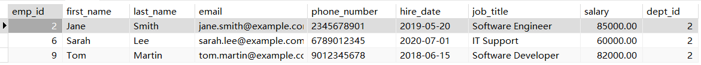

#  《 SQL练习》


> **学院：省级示范性软件学院**
>
> **题目：**《SQL练习》
>
> **姓名：**李小龙
>
> **学号：**2200770141
>
> **班级：**软工2202
>
> **日期：**2024-10-18
>
> **实验环境：** Navicat


## 一、实验目的

​	通过大量的SQL练习，提高SQL技能。


## 二、实验内容

​	基本查询、表连接、子查询、聚合函数、排序、分组。


## 三、实验步骤

### 1.员工信息练习题：

（1）查询所有员工的姓名、邮箱和工作岗位。

```sql
-- 1. 查询所有员工的姓名、邮箱和工作岗位。
SELECT CONCAT(e.first_name,' ',e.last_name) 姓名,email 邮箱,job_title 工作岗位
FROM employees e;
```


（2）查询所有部门的名称和位置。

```sql
-- 2. 查询所有部门的名称和位置。
SELECT d.dept_name 部门名称,d.location 位置
FROM departments d;
```


（3）查询工资超过70000的员工姓名和工资。

```sql
-- 3. 查询工资超过70000的员工姓名和工资。
SELECT CONCAT(e.first_name,' ',e.last_name) 姓名,e.salary 工资
FROM employees e
WHERE e.salary>70000;
```


（4）查询IT部门的所有员工。

```sql
-- 4. 查询IT部门的所有员工。
SELECT *
FROM employees e
WHERE e.dept_id=(SELECT d.dept_id FROM departments d WHERE d.dept_name='IT'); 
```




（5）查询入职日期在2020年之后的员工信息。

```sql
-- 5. 查询入职日期在2020年之后的员工信息。
SELECT *
FROM employees e
WHERE YEAR(e.hire_date)>2020
```


（6）计算每个部门的平均工资。

```sql
-- 6. 计算每个部门的平均工资。
SELECT d.dept_name 部门,AVG(e.salary) 平均工资
FROM employees e,departments d
WHERE e.dept_id=d.dept_id
GROUP BY e.dept_id;
```


（7）查询工资最高的前3名员工信息。

```sql
-- 7. 查询工资最高的前3名员工信息。
WITH rank_salary AS(
	SELECT e.*,
	RANK() over(ORDER BY e.salary DESC) AS rank_id
	FROM employees e
)
SELECT *
FROM rank_salary
WHERE rank_id<=3;
```


（8）查询每个部门员工数量。

```sql
-- 8. 查询每个部门员工数量。
SELECT d.dept_name 部门,COUNT(e.emp_id) 数量
FROM employees e,departments d
WHERE d.dept_id=e.dept_id
GROUP BY e.dept_id;
```


（9）查询没有分配部门的员工。

```sql
-- 9. 查询没有分配部门的员工。
SELECT *
FROM employees e
WHERE e.dept_id is NULL;
```


（10）查询参与项目数量最多的员工。

```sql
-- 10. 查询参与项目数量最多的员工。
WITH rank_number AS (
    SELECT 
        ep.emp_id,
        COUNT(ep.project_id) AS number,
        RANK() OVER (ORDER BY COUNT(ep.project_id) DESC) AS number_rank
    FROM employee_projects ep
    GROUP BY ep.emp_id
)
SELECT e.*
FROM employees e
JOIN rank_number rn ON e.emp_id = rn.emp_id
WHERE rn.number_rank <= 1;
```


（11）计算所有员工的工资总和。

```sql
-- 11. 计算所有员工的工资总和。
SELECT SUM(e.salary) 工资总和
FROM employees e
```


（12）查询姓"Smith"的员工信息。

```sql
-- 12. 查询姓"Smith"的员工信息。
SELECT e.*
FROM employees e
WHERE e.last_name='Smith';
```


（13）查询即将在半年内到期的项目。

```sql
-- 13. 查询即将在半年内到期的项目。
SELECT p.*
FROM projects p
WHERE p.end_date BETWEEN NOW() AND DATE_ADD(NOW(),INTERVAL 6 MONTH);
```


（14）查询至少参与了两个项目的员工。

```sql
-- 14. 查询至少参与了两个项目的员工。
WITH pro_number AS(
	SELECT ep.emp_id,COUNT(ep.emp_id) total_projects
	FROM employee_projects ep
	GROUP BY ep.emp_id
)
SELECT e.*
FROM employees e
JOIN pro_number pn ON e.emp_id=pn.emp_id
WHERE pn.total_projects>=2;
```


（15）查询没有参与任何项目的员工。

```sql
-- 15. 查询没有参与任何项目的员工。
SELECT e.*
FROM employees e
WHERE e.emp_id NOT IN (SELECT ep.emp_id FROM employee_projects ep);
```


（16）计算每个项目参与的员工数量。

```sql
-- 16. 计算每个项目参与的员工数量。
SELECT p.project_name,COUNT(emp_id) 参与数量
FROM projects p,employee_projects ep
WHERE p.project_id=ep.project_id
GROUP BY ep.project_id;
```


（17）查询工资第二高的员工信息。

```sql
-- 17. 查询工资第二高的员工信息。
WITH rank_em AS(
SELECT e.*,
RANK() over(ORDER BY e.salary) AS rank_salary
FROM employees e
)
SELECT e.*
FROM rank_em e
WHERE rank_salary=2;
```


（18）查询每个部门工资最高的员工。

```sql
-- 18. 查询每个部门工资最高的员工。
WITH rank_dp_high AS(
	SELECT e.*,
	RANK() over(PARTITION by e.dept_id ORDER BY e.salary) AS rank_first
	FROM employees e
)
SELECT *
FROM rank_dp_high
WHERE rank_first = 1;
```


（19）计算每个部门的工资总和,并按照工资总和降序排列。

```sql
-- 19. 计算每个部门的工资总和,并按照工资总和降序排列。
SELECT d.dept_name,SUM(e.salary) 工资总和
FROM employees e,departments d
WHERE e.dept_id=d.dept_id
GROUP BY d.dept_id
ORDER BY SUM(e.salary) DESC;
```


（20）查询员工姓名、部门名称和工资。

```sql
-- 20. 查询员工姓名、部门名称和工资。
SELECT CONCAT(e.first_name,' ',e.last_name) 姓名,d.dept_name 部门名称,e.salary 工资
FROM employees e,departments d
WHERE e.dept_id=d.dept_id;
```


（21）查询每个员工的上级主管(假设emp_id小的是上级)。

```sql
-- 21. 查询每个员工的上级主管(假设emp_id小的是上级)。
SELECT CONCAT(e1.first_name,' ',e1.last_name) 员工,CONCAT(e1.first_name,' ',e1.last_name) 上级主管
FROM employees e1
LEFT JOIN employees e2 ON e1.dept_id = e2.dept_id AND e1.emp_id > e2.emp_id;
```


（22）查询所有员工的工作岗位,不要重复。

```sql
-- 22. 查询所有员工的工作岗位,不要重复。
SELECT DISTINCT CONCAT(e.first_name,' ',e.last_name) 员工,e.job_title 工作岗位
FROM employees e;
```


（23）查询平均工资最高的部门。

```sql
-- 23. 查询平均工资最高的部门。
WITH avg_salary AS(
	SELECT d.dept_name,avg(e.salary) avgs
	FROM employees e,departments d
	WHERE d.dept_id=e.dept_id
	GROUP BY e.dept_id
)
SELECT dept_name
FROM avg_salary
ORDER BY avgs DESC
LIMIT 1;
```


（24）查询工资高于其所在部门平均工资的员工。

```sql
-- 24. 查询工资高于其所在部门平均工资的员工。
WITH avg_salary AS(
	SELECT d.dept_id,d.dept_name,avg(e.salary) avgs
	FROM employees e,departments d
	WHERE d.dept_id=e.dept_id
	GROUP BY e.dept_id
)
SELECT e.*
FROM employees e,avg_salary av
WHERE e.dept_id=av.dept_id AND e.salary>avgs;
```


（25）查询每个部门工资前两名的员工。

```sql
-- 25. 查询每个部门工资前两名的员工。
WITH ranked_employees AS (
	 SELECT e.*, d.dept_name,
	 RANK() OVER(PARTITION BY e.dept_id ORDER BY e.salary DESC) AS salary_rank
	 FROM employees e
	 JOIN departments d ON e.dept_id = d.dept_id
)
SELECT *
FROM ranked_employees
WHERE salary_rank <= 2;
```


### 2.学生选课题：

（1）查询所有学生的信息。

```sql
-- 1. 查询所有学生的信息。
SELECT s.*
FROM student s;
```


（2）查询所有课程的信息。

```sql
-- 2. 查询所有课程的信息。
SELECT c.*
FROM course c;
```


（3）查询所有学生的姓名、学号和班级。

```sql
-- 3. 查询所有学生的姓名、学号和班级。
SELECT s.name,s.student_id,s.my_class 
FROM student s
```


（4）查询所有教师的姓名和职称。

```sql
-- 4. 查询所有教师的姓名和职称。
SELECT name,title
FROM teacher;
```


（5）查询不同课程的平均分数。

```sql
-- 5. 查询不同课程的平均分数。
SELECT sc.course_id,AVG(sc.score) 平均分数
FROM score sc
GROUP BY sc.course_id;
```


（6）查询每个学生的平均分数。

```sql
-- 6. 查询每个学生的平均分数。
SELECT s.name,AVG(sc.score) 平均分数
FROM student s,score sc
WHERE s.student_id=sc.student_id
GROUP BY s.student_id;
```


（7）查询分数大于85分的学生学号和课程号。

```sql
-- 7. 查询分数大于85分的学生学号和课程号。
SELECT student_id,course_id
FROM score sc
WHERE sc.score>85; 
```


（8）查询每门课程的选课人数。

```sql
-- 8. 查询每门课程的选课人数。
SELECT c.course_name,COUNT(sc.student_id) 选课人数
FROM course c,score sc
WHERE c.course_id=sc.course_id
GROUP BY sc.course_id;
```


（9）查询选修了"高等数学"课程的学生姓名和分数。

```sql
-- 9. 查询选修了"高等数学"课程的学生姓名和分数。
SELECT name,score
FROM student,course,score
WHERE student.student_id=score.student_id AND score.course_id=course.course_id AND course_name='高等数学';
```


（10）查询没有选修"大学物理"课程的学生姓名。

```sql
-- 10. 查询没有选修"大学物理"课程的学生姓名。
SELECT s.name
FROM student s
WHERE s.student_id NOT IN (
    SELECT sc.student_id
    FROM score sc
    JOIN course c ON sc.course_id = c.course_id
    WHERE c.course_name = '大学物理');
```


（11）查询C001比C002课程成绩高的学生信息及课程分数。

```sql
-- 11. 查询C001比C002课程成绩高的学生信息及课程分数。
SELECT s.*,sc1.score c1,sc2.score c2
FROM student s
JOIN score sc1 ON s.student_id = sc1.student_id
JOIN score sc2 ON s.student_id = sc2.student_id
WHERE sc1.course_id = 'C001' AND sc2.course_id = 'C002' AND sc1.score > sc2.score;
```


（12）统计各科成绩各分数段人数：课程编号，课程名称，[100-85]，[85-70]，[70-60]，[60-0] 及所占百分比

```sql
-- 12. 统计各科成绩各分数段人数：课程编号，课程名称，[100-85]，[85-70]，[70-60]，[60-0] 及所占百分比
SELECT 
    c.course_id,
    c.course_name,
    SUM(CASE WHEN sc.score BETWEEN 85 AND 100 THEN 1 ELSE 0 END) AS '85-100',
    SUM(CASE WHEN sc.score BETWEEN 70 AND 84 THEN 1 ELSE 0 END) AS '70-84',
    SUM(CASE WHEN sc.score BETWEEN 60 AND 69 THEN 1 ELSE 0 END) AS '60-69',
    SUM(CASE WHEN sc.score BETWEEN 0 AND 59 THEN 1 ELSE 0 END) AS '0-59',
    ROUND(SUM(CASE WHEN sc.score BETWEEN 85 AND 100 THEN 1 ELSE 0 END) / COUNT(sc.score) * 100, 2) AS '85-100百分比',
    ROUND(SUM(CASE WHEN sc.score BETWEEN 70 AND 84 THEN 1 ELSE 0 END) / COUNT(sc.score) * 100, 2) AS '70-84百分比',
    ROUND(SUM(CASE WHEN sc.score BETWEEN 60 AND 69 THEN 1 ELSE 0 END) / COUNT(sc.score) * 100, 2) AS '60-69百分比',
    ROUND(SUM(CASE WHEN sc.score BETWEEN 0 AND 59 THEN 1 ELSE 0 END) / COUNT(sc.score) * 100, 2) AS '0-59百分比'
FROM 
    course c
JOIN 
    score sc ON c.course_id = sc.course_id
GROUP BY 
    c.course_id;
```


（13）查询选择C002课程但没选择C004课程的成绩情况(不存在时显示为 null )。

```sql
-- 13. 查询选择C002课程但没有选择C004课程的成绩情况(不存在时显示为 null )。
SELECT s.student_id, s.name, sc2.score AS C002_score, sc4.score AS C004_score
FROM student s
LEFT JOIN score sc2 ON s.student_id = sc2.student_id AND sc2.course_id = 'C002'
LEFT JOIN score sc4 ON s.student_id = sc4.student_id AND sc4.course_id = 'C004'
WHERE sc2.course_id IS NOT NULL AND sc4.course_id IS NULL;
```


（14）查询平均分数最高的学生姓名和平均分数。

```sql
-- 14. 查询平均分数最高的学生姓名和平均分数。
SELECT s.name, AVG(sc.score) AS average_score
FROM student s
JOIN score sc ON s.student_id = sc.student_id
GROUP BY s.student_id
ORDER BY average_score DESC
LIMIT 1;
```


（15）查询总分最高的前三名学生的姓名和总分。

```sql
-- 15. 查询总分最高的前三名学生的姓名和总分。
SELECT s.name, SUM(sc.score) AS total_score
FROM student s
JOIN score sc ON s.student_id = sc.student_id
GROUP BY s.student_id
ORDER BY total_score DESC
LIMIT 3;
```


（16）查询所有课程分数都高于85分的学生姓名。

```sql
-- 16.  查询所有课程分数都高于85分的学生姓名。
SELECT s.name
FROM student s
JOIN score sc ON s.student_id = sc.student_id
GROUP BY s.student_id, s.name
HAVING MIN(sc.score) > 85;
```


（17）查询男生和女生的人数。

```sql
-- 17. 查询男生和女生的人数。
SELECT gender, COUNT(*) AS 人数
FROM student
GROUP BY gender;
```


（18）查询年龄最大的学生姓名。

```sql
-- 18. 查询年龄最大的学生姓名。
SELECT s.name
FROM student s
ORDER BY s.birth_date ASC
LIMIT 1;
```


（19）查询年龄最小的教师姓名。

```sql
-- 19. 查询年龄最小的教师姓名。
SELECT name
FROM teacher
ORDER BY birth_date DESC
LIMIT 1;
```


（20）查询学过「张教授」授课的同学的信息。

```sql
-- 20. 查询学过「张教授」授课的同学的信息。
SELECT DISTINCT s.*
FROM student s
JOIN score sc ON s.student_id = sc.student_id
JOIN course c ON sc.course_id = c.course_id
WHERE c.teacher_id = (SELECT teacher_id FROM teacher WHERE name='张教授');
```


（21）查询查询至少有一门课与学号为"2021001"的同学所学相同的同学的信息 。

```sql
-- 21. 查询查询至少有一门课与学号为"2021001"的同学所学相同的同学的信息 。
SELECT DISTINCT s.*
FROM student s
JOIN score sc1 ON s.student_id = sc1.student_id
WHERE sc1.course_id IN (SELECT course_id FROM score WHERE student_id = '2021001') AND s.student_id != '2021001';
```


（22）查询每门课程的平均分数，并按平均分数降序排列。

```sql
-- 22. 查询每门课程的平均分数，并按平均分数降序排列。
SELECT c.course_name, AVG(sc.score) AS average_score
FROM course c
LEFT JOIN score sc ON c.course_id = sc.course_id
GROUP BY c.course_id, c.course_name
ORDER BY average_score DESC;
```


（23）查询学号为"2021001"的学生所有课程的分数。

```sql
-- 23. 查询学号为"2021001"的学生所有课程的分数。
SELECT c.course_name, sc.score
FROM score sc
JOIN course c ON sc.course_id = c.course_id
WHERE sc.student_id = '2021001';
```


（24）查询所有学生的姓名、选修的课程名称和分数。

```sql
-- 24. 查询所有学生的姓名、选修的课程名称和分数。
SELECT s.name, c.course_name, sc.score
FROM student s
JOIN score sc ON s.student_id = sc.student_id
JOIN course c ON sc.course_id = c.course_id;
```


（25）查询每个教师所教授课程的平均分数。

```sql
	-- 25. 查询每个教师所教授课程的平均分数。
SELECT t.name, AVG(sc.score) AS 平均分数
FROM teacher t
JOIN course c ON t.teacher_id = c.teacher_id
JOIN score sc ON c.course_id = sc.course_id
GROUP BY t.teacher_id, t.name;
```


（26）查询分数在80到90之间的学生姓名和课程名称。

```sql
-- 26. 查询分数在80到90之间的学生姓名和课程名称。
SELECT s.name, c.course_name
FROM student s
JOIN score sc ON s.student_id = sc.student_id
JOIN course c ON sc.course_id = c.course_id
WHERE sc.score BETWEEN 80 AND 90;
```


（27）查询每个班级的平均分数。

```sql
-- 27. 查询每个班级的平均分数。
SELECT s.my_class, AVG(sc.score) AS 平均分数
FROM student s
JOIN score sc ON s.student_id = sc.student_id
GROUP BY s.my_class;
```


（28）查询没学过"王讲师"老师讲授的任一门课程的学生姓名。

```sql
-- 28. 查询没学过"王讲师"老师讲授的任一门课程的学生姓名。
SELECT s.name
FROM student s
WHERE s.student_id NOT IN (
    SELECT sc.student_id
    FROM score sc
    JOIN course c ON sc.course_id = c.course_id
    WHERE c.teacher_id = (SELECT teacher_id FROM teacher WHERE name='王讲师'));
```


（29）查询两门及其以上小于85分的同学的学号，姓名及其平均成绩 。

```sql
-- 29. 查询两门及其以上小于85分的同学的学号，姓名及其平均成绩 。
SELECT s.student_id, s.name, AVG(sc.score) AS 平均成绩
FROM student s
JOIN score sc ON s.student_id = sc.student_id
WHERE sc.score < 85
GROUP BY s.student_id
HAVING COUNT(sc.course_id) >= 2;
```


（30）查询所有学生的总分并按降序排列。

```sql
-- 30. 查询所有学生的总分并按降序排列。
SELECT s.name, SUM(sc.score) AS total_score
FROM student s
JOIN score sc ON s.student_id = sc.student_id
GROUP BY s.student_id
ORDER BY total_score DESC;
```


（31）查询平均分数超过85分的课程名称。

```sql
-- 31. 查询平均分数超过85分的课程名称。
SELECT c.course_name
FROM course c
JOIN score sc ON c.course_id = sc.course_id
GROUP BY c.course_id
HAVING AVG(sc.score) > 85;
```


（32）查询每个学生的平均成绩排名。

```sql
-- 32. 查询每个学生的平均成绩排名。
SELECT s.name, AVG(sc.score) AS 平均成绩,
       RANK() OVER (ORDER BY AVG(sc.score) DESC) AS 排名
FROM student s
JOIN score sc ON s.student_id = sc.student_id
GROUP BY s.student_id;
```


（33）查询每门课程分数最高的学生姓名和分数。

```sql
-- 33. 查询每门课程分数最高的学生姓名和分数。
SELECT c.course_name,s.name,sc.score
FROM score sc
JOIN course c ON sc.course_id = c.course_id
JOIN student s ON sc.student_id = s.student_id
WHERE (c.course_id, sc.score) IN (SELECT course_id, MAX(score) FROM score GROUP BY course_id);
```


（34）查询选修了"高等数学"和"大学物理"的学生姓名。

```sql
-- 34. 查询选修了"高等数学"和"大学物理"的学生姓名。
SELECT s.name
FROM student s
JOIN score sc1 ON s.student_id = sc1.student_id
JOIN course c1 ON sc1.course_id = c1.course_id
JOIN score sc2 ON s.student_id = sc2.student_id
JOIN course c2 ON sc2.course_id = c2.course_id
WHERE c1.course_name = '高等数学' AND c2.course_name = '大学物理';
```


（35）按平均成绩从高到低显示所有学生的所有课程的成绩以及平均成绩（没有选课则为空）。

```sql
-- 35. 按平均成绩从高到低显示所有学生的所有课程的成绩以及平均成绩（没有选课则为空）。
SELECT s.name,c.course_name,sc.score,AVG(sc.score) OVER (PARTITION BY s.student_id) AS avg_score
FROM student s
LEFT JOIN score sc ON s.student_id = sc.student_id
LEFT JOIN course c ON sc.course_id = c.course_id
ORDER BY avg_score DESC;
```


（36）查询分数最高和最低的学生姓名及其分数。

```sql
-- 36. 查询分数最高和最低的学生姓名及其分数。
SELECT s.name, sc.score
FROM student s
JOIN score sc ON s.student_id = sc.student_id
WHERE sc.score = (SELECT MAX(score) FROM score) OR sc.score = (SELECT MIN(score) FROM score);
```


（37）查询每个班级的最高分和最低分。

```sql
-- 37. 查询每个班级的最高分和最低分。
SELECT s.my_class, MAX(sc.score) AS 最高分, MIN(sc.score) AS 最低分
FROM student s
JOIN score sc ON s.student_id = sc.student_id
GROUP BY s.my_class;
```


（38）查询每门课程的优秀率（优秀为90分）。

```sql
-- 38. 查询每门课程的优秀率（优秀为90分）。
SELECT c.course_name,SUM(CASE WHEN sc.score >= 90 THEN 1 ELSE 0 END) / COUNT(sc.score) * 100 AS 优秀率
FROM course c
LEFT JOIN score sc ON c.course_id = sc.course_id
GROUP BY c.course_id;
```


（39）查询平均分数超过班级平均分数的学生。

```sql
-- 39. 查询平均分数超过班级平均分数的学生。
SELECT s.*,AVG(sc.score) AS p_avg_sc,AVG(avg_class_score) AS c_avg_sc
FROM student s
JOIN score sc ON s.student_id = sc.student_id
JOIN (SELECT my_class, AVG(score) AS avg_class_score FROM student st JOIN score scr ON st.student_id = scr.student_id GROUP BY my_class)
			AS class_avg ON s.my_class = class_avg.my_class
GROUP BY s.student_id
HAVING p_avg_sc>c_avg_sc;
```


（40）查询每个学生的分数及其与课程平均分的差值。

```sql
-- 40. 查询每个学生的分数及其与课程平均分的差值。
SELECT s.name,c.course_name,
       (sc.score - avg_score) AS 差值
FROM score sc
JOIN student s ON sc.student_id = s.student_id
JOIN course c ON sc.course_id = c.course_id
JOIN (SELECT course_id, AVG(score) AS avg_score FROM score GROUP BY course_id) AS avg_scores ON sc.course_id = avg_scores.course_id;
```


