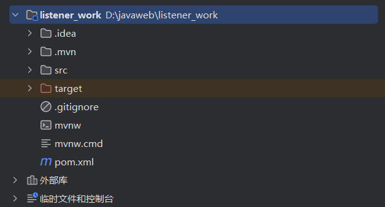
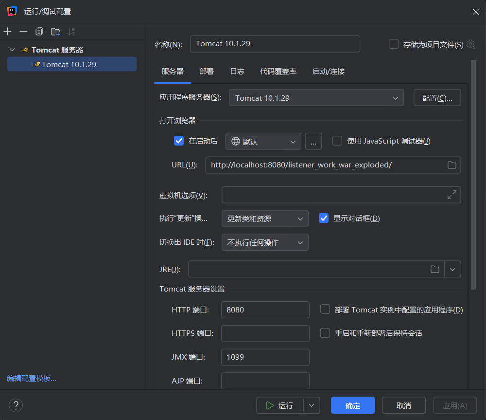
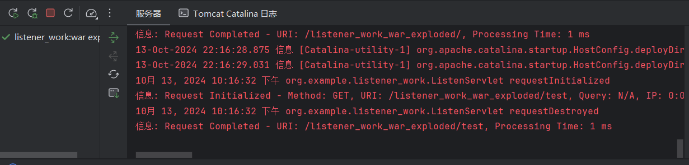

#  JavaWeb


**学院：省级示范性软件学院**

**题目：**《 Listener》

**姓名：**李小龙

**学号：**2200770141

**班级：**软工2202

**日期：**2024-10-12

**实验环境：** IDEA，Typora


## 一、实验目的

**1.学习 ServletRequestListener 的使用方法：**

​	掌握如何实现ServletRequestListener接口，并理解它在 Web 应用程序中监听和处理请求生命周期事件的作用。

**2.实现 HTTP 请求日志记录机制：**

​	通过监听每个 HTTP 请求，记录请求的详细信息，如请求时间、客户端 IP 地址、请求方法、URI、查询字符串和 User-Agent 等，从而实现全面的请求日志记录。

**3.计算和记录请求处理时间：**

​	在请求开始时记录时间，并在请求结束时计算处理时间，掌握如何通过监听器获取请求生命周期的信息。

**4.设计易于阅读和分析的日志格式：**

​	以合适的格式记录日志，确保日志信息清晰明了，易于分析和排查问题。

**5.实现和测试日志功能：**

​	通过创建一个简单的测试 Servlet 验证日志记录功能的正确性。

**6.提升调试和性能分析的能力：**

​	通过记录和分析日志数据，提升监控 Web 应用性能和调试问题的能力。


## 二、实验内容

**1.创建一个监听器类**

**2.记录 HTTP 请求详细信息**

**3.计算请求处理时间**

**4.设计和实现日志格式**

**5.创建测试 Servlet**


## 三、实验步骤

#### 1.项目创建：

​	首先，创建一个名为listener_work的项目文件，并且配置其tomcat设置。






#### 2.Listener设计：

​	创建一个"ListenServlet.java"文件，在其中编写一个Listener进行对HTTP请求的记录。

```java
package org.example.listener_work;

import jakarta.servlet.ServletRequestEvent;
import jakarta.servlet.ServletRequestListener;
import jakarta.servlet.annotation.WebListener;
import jakarta.servlet.http.HttpServletRequest;

import java.util.logging.Logger;

@WebListener
public class ListenServlet implements ServletRequestListener {
    private static final Logger logger = Logger.getLogger(ListenServlet.class.getName());

    static {
        rizhi.setup();  // 初始化日志配置
    }

    @Override
    public void requestInitialized(ServletRequestEvent sre) {
        HttpServletRequest request = (HttpServletRequest) sre.getServletRequest();
        request.setAttribute("startTime", System.currentTimeMillis());

        String method = request.getMethod();
        String uri = request.getRequestURI();
        String queryString = request.getQueryString();
        String clientIp = request.getRemoteAddr();
        String userAgent = request.getHeader("User-Agent");

        logger.info(String.format("Request Initialized - Method: %s, URI: %s, Query: %s, IP: %s, User-Agent: %s",
                method, uri, queryString != null ? queryString : "N/A", clientIp, userAgent));
    }

    @Override
    public void requestDestroyed(ServletRequestEvent sre) {
        HttpServletRequest request = (HttpServletRequest) sre.getServletRequest();
        long startTime = (long) request.getAttribute("startTime");
        long processingTime = System.currentTimeMillis() - startTime;

        logger.info(String.format("Request Completed - URI: %s, Processing Time: %d ms",
                request.getRequestURI(), processingTime));
    }
}
```


#### 3.测试Servlet的设计：

​	创建一个"TestServlet.java"文件，在其中编写java代码实现对上一个步骤中的LIstener监听的测试。

```java
package org.example.listener_work;

import jakarta.servlet.ServletException;
import jakarta.servlet.annotation.WebServlet;
import jakarta.servlet.http.HttpServlet;
import jakarta.servlet.http.HttpServletRequest;
import jakarta.servlet.http.HttpServletResponse;

import java.io.IOException;

@WebServlet("/test")
public class TestServlet extends HttpServlet {
    @Override
    protected void doGet(HttpServletRequest req, HttpServletResponse resp) throws ServletException, IOException {
        resp.setContentType("text/plain");
        resp.getWriter().write("Request Logging Test Successful");
    }

    @Override
    protected void doPost(HttpServletRequest req, HttpServletResponse resp) throws ServletException, IOException {
        resp.setContentType("text/plain");
        resp.getWriter().write("Post Request Logging Test Successful");
    }
}

```


#### 4.日志信息的输出：

​	创建一个"rizhi.java"文件用于将Listener监听器所记录的信息打印在控制台。

```java
package org.example.listener_work;

import java.util.logging.ConsoleHandler;
import java.util.logging.Handler;
import java.util.logging.Level;
import java.util.logging.Logger;
import java.util.logging.SimpleFormatter;

public class rizhi {
    public static void setup() {
        Logger rootLogger = Logger.getLogger("");
        rootLogger.setLevel(Level.INFO);

        // 移除默认的控制台处理器
        for (Handler handler : rootLogger.getHandlers()) {
            if (handler instanceof ConsoleHandler) {
                rootLogger.removeHandler(handler);
            }
        }

        // 添加自定义的控制台处理器
        ConsoleHandler consoleHandler = new ConsoleHandler();
        consoleHandler.setLevel(Level.INFO);
        consoleHandler.setFormatter(new SimpleFormatter());
        rootLogger.addHandler(consoleHandler);
    }
}


```


#### 5.项目演示：


