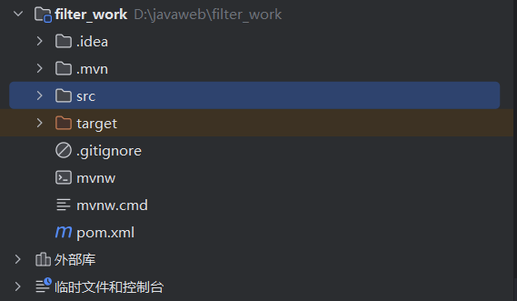
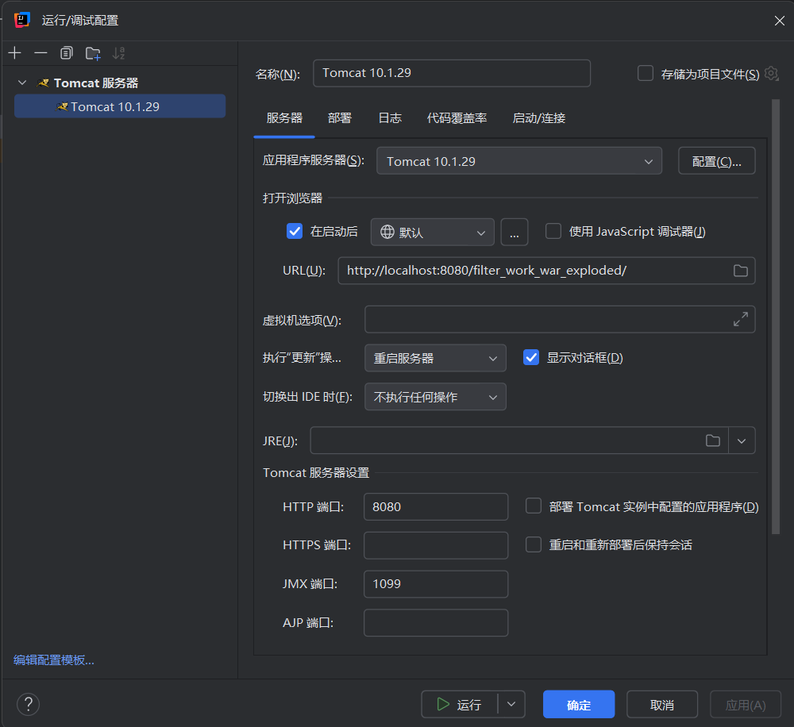
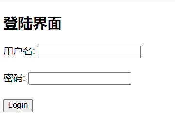
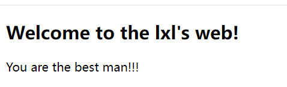
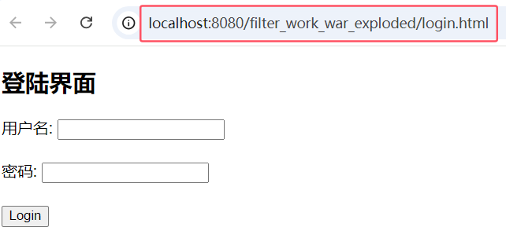
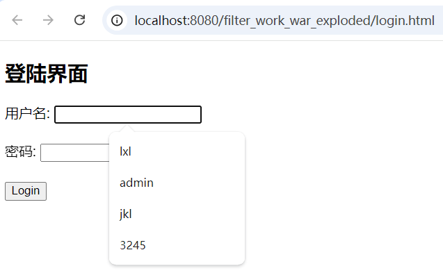
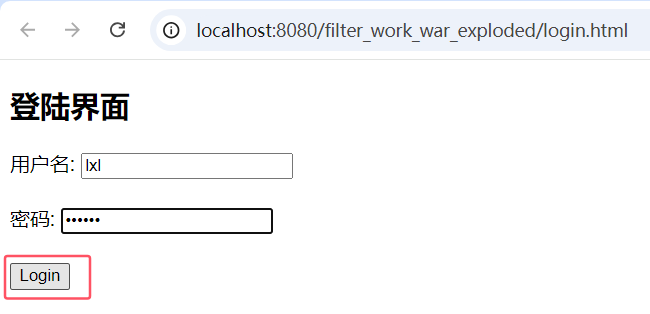
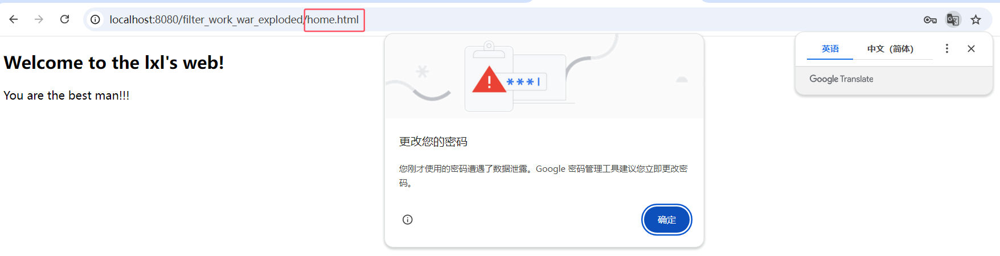
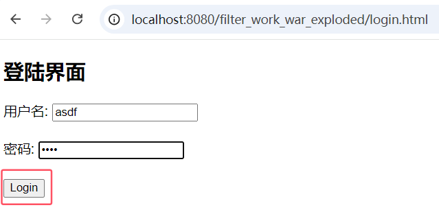
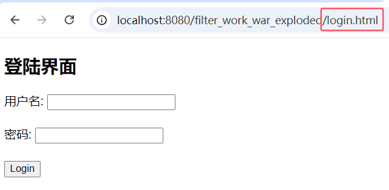

#  JavaWeb


**学院：省级示范性软件学院**

**题目：**《 Filter》

**姓名：**李小龙

**学号：**2200770141

**班级：**软工2202

**日期：**2024-10-12

**实验环境：** IDEA，Typora


## 一、实验目的

**1.学习 Servlet 过滤器的实现方式：**

​	掌握如何创建和配置过滤器，通过实现 `LoginFilter` 类，理解过滤器在请求和响应生命周期中的作用。

**2.实现用户登录验证机制：**

​	通过过滤器验证用户是否已登录，学习如何利用会话（Session）属性来判断用户的登录状态，并根据情况执行请求转发或重定向。

**3.掌握过滤器注解配置：**

​	使用 `@WebFilter` 注解配置过滤器的作用范围，并理解其在 Web 应用中的实际应用效果。

**4.实践排除路径管理：**

​	创建和维护一个排除列表，了解如何通过逻辑判断来确定特定路径是否应被过滤器处理，以支持公开页面或资源的访问。

**5.理解请求重定向的实现：**

​	实现将未登录用户重定向到登录页面的逻辑，并掌握重定向的方法和在实际应用中的应用场景。


## 二、实验内容

**1.创建过滤器类：**

​	实现一个名为 `LoginFilter` 的类，并实现 `javax.servlet.Filter` 接口。

**2.配置过滤器：**

​	使用 `@WebFilter` 注解配置过滤器，使其应用于所有 URL 路径（`"/*"`）。

**3.实现过滤器逻辑：**

​	在LoginFilter中实现以下逻辑：

- 检查当前请求是否是登录页面、注册页面或公共资源的请求。如果是，允许请求通过。
- 否则，检查用户的 session 中是否有表示已登录的属性。
- 如果用户已登录，允许请求继续；如果未登录，将请求重定向到登录页面。

**4.创建排除列表：**

​	创建一个排除列表，包含不需要登录即可访问的路径。


## 三、实验步骤

#### 1.项目创建：

​	首先，创建一个名为filter_work的项目文件，并且配置其tomcat设置。






#### 2.登录界面：

​	创建"login.html"文件，编写代码在网页端口实现登录界面的可视化。

```html
<!DOCTYPE html>
<html lang="en">
<head>
  <meta charset="UTF-8">
  <title>Login</title>
</head>
<body>
<h2>登陆界面</h2>
<form action="login" method="post">
  <label for="username">用户名:</label>
  <input type="text" id="username" name="username" required><br><br>
  <label for="password">密码:</label>
  <input type="password" id="password" name="password" required><br><br>
  <input type="submit" value="Login">
</form>
</body>
</html>

```




#### 3.主界面：

​	创建"home.html"文件，编写代码在网页端口实现登录成功后所进入的页面的可视化。

```html
<!DOCTYPE html>
<html>
<head>
  <title>Home</title>
</head>
<body>
<h2>Welcome to the lxl's web!</h2>
<p>You are the best man!!!</p>
</body>
</html>
```





#### 4.Filter的设计：

​	创建一个名为"LoginFilter.java"的文件，在此文档中设计filter过滤器，实现对于能够成功登录的用户跳转到home主界面，被排除掉的文件放行以及未能登录成功的用户始终重定向在登陆界面功能。

```java
package org.example.filter_work;


import jakarta.servlet.*;
import jakarta.servlet.annotation.WebFilter;
import jakarta.servlet.http.HttpServletRequest;
import jakarta.servlet.http.HttpServletResponse;
import jakarta.servlet.http.HttpSession;

import java.io.IOException;
import java.util.Arrays;
import java.util.List;

@WebFilter("/*")
public class LoginFilter implements Filter {

    // 排除列表，包含不需要登录就能访问的路径
    private static final List<String> EXCLUDED_PATHS = Arrays.asList(
            "/login.html",
            "/home.html",
            "login"
    );

    //初始化
    @Override
    public void init(FilterConfig filterConfig) throws ServletException {
        Filter.super.init(filterConfig);
    }

    @Override
    public void doFilter(ServletRequest request, ServletResponse response, FilterChain chain) throws IOException, ServletException {
        HttpServletRequest httpRequest = (HttpServletRequest) request;
        HttpServletResponse httpResponse = (HttpServletResponse) response;

        boolean isStaticResource = EXCLUDED_PATHS.stream().anyMatch(ext->{
            System.out.println("ext:"+ext);
            return httpRequest.getRequestURI().contains(ext);
        });

        if (isStaticResource) {
            chain.doFilter(request, response);
        }else {
            String username =(String)httpRequest.getSession().getAttribute("username");
            if ("".equals(username)||username==null) {
                httpResponse.sendRedirect(httpRequest.getContextPath()+"/login.html");
            }else {
                chain.doFilter(request, response);
            }
        }

    }

    @Override
    public void destroy() {

    }

}
```


#### 5.Servlet的设计：

​	设计一个LoginServlet用于处理客户端的请求，对于能够成功登录的用户和排除掉的路径文件能够成功访问，而对于无法登录的用户让其重定向到登录界面。

```java
package org.example.filter_work;

import jakarta.servlet.ServletException;
import jakarta.servlet.annotation.WebServlet;
import jakarta.servlet.http.HttpServlet;
import jakarta.servlet.http.HttpServletRequest;
import jakarta.servlet.http.HttpServletResponse;
import jakarta.servlet.http.HttpSession;

import java.io.IOException;

@WebServlet(urlPatterns = "/login")
public class LoginServlet extends HttpServlet {
    @Override
    protected void doGet(HttpServletRequest request, HttpServletResponse response) throws ServletException, IOException {
        request.getRequestDispatcher("/login.html").forward(request, response);
    }

    @Override
    protected void doPost(HttpServletRequest request, HttpServletResponse response) throws ServletException, IOException {
        String username = request.getParameter("username");
        String password = request.getParameter("password");

        if ("lxl".equals(username) && "123456".equals(password)) {
            // 设置用户名到会话中
            HttpSession session = request.getSession();
            session.setAttribute("username", username);

            // 重定向到home.html
            response.sendRedirect(request.getContextPath() + "/home.html");
        } else {
            // 重定向回登录页面
            response.sendRedirect(request.getContextPath() + "/login.html");
        }
    }
}

```


#### 6.配置web.xml文件：

​	进入到“src/main/WEB-INF”目录，找到并配置web.xml文件，在其中添加”welcom-file-list"标签并且将登录界面的代码文件名作为内容放入其中，使得项目运行后打开的的界面即为登录界面。

```xml
<welcome-file-list>
        <welcome-file>login.html</welcome-file>
    </welcome-file-list>
```





#### 7.登录成功验证：

​	输入一个能成功登录的用户名与密码，登录成功后界面跳转到"home.html"所设计的界面。








#### 8.登录失败重定向验证：

​	输入一个没有登录权限的用户名与密码，检查其登录失败后重定向的界面。






#### 